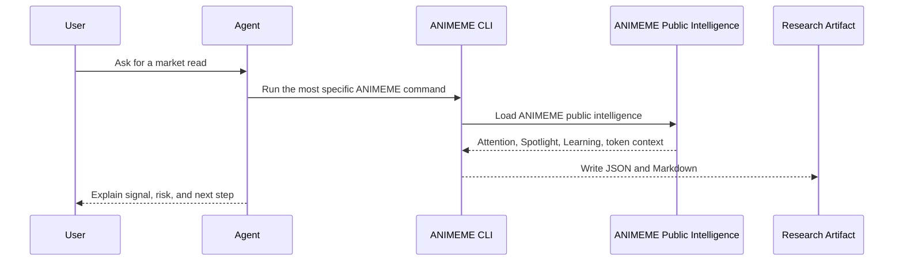

# ANIMEME Agent Skill

> Charts are late. Memes move first.

ANIMEME Agent Skill is a read-only intelligence layer for agents that need to
understand meme attention before a chart makes the move obvious.

It turns ANIMEME public intelligence into agent-ready workflows: live attention
reads, spotlight context, narrative memory, token research, thesis generation,
risk review, and watch plans. The skill is built for Codex, Claude Code,
OpenCode, OpenClaw, and any runtime that can install AgentSkills-compatible
repositories.

```bash
npx skills add animeme99/Animeme-Agent
```

## Public Links

- Product: [animeme.app](https://animeme.app)
- Agent Skill: [github.com/animeme99/Animeme-Agent](https://github.com/animeme99/Animeme-Agent)

## Documentation Boundary

This public repository documents ANIMEME as the only public intelligence
surface.

Public docs must not expose, name, map, or describe upstream provider
endpoints. Agents should treat every workflow as ANIMEME intelligence unless a
local operator has separately configured private enrichment outside the public
documentation surface.

Allowed public language:

- ANIMEME public intelligence
- ANIMEME live attention
- ANIMEME token context
- ANIMEME narrative memory
- ANIMEME spotlight signals
- ANIMEME learning archive
- ANIMEME artifact output

Avoid public documentation that exposes:

- upstream provider endpoint URLs
- upstream provider route paths
- upstream provider credential names
- adapter internals
- private infrastructure topology
- account, wallet, signing, or trading instructions

The public story is simple: agents connect to ANIMEME, ANIMEME returns
structured attention intelligence, and the agent turns that intelligence into a
clear research answer.

## What ANIMEME Does

ANIMEME studies the social object behind a token move before the move becomes
obvious on a chart.

It answers five questions:

1. What has attention right now?
2. Why is this meme or narrative spreading?
3. What catalyst made the attention legible?
4. Has this kind of pattern worked before?
5. Is the crowd early, rising, crowded, weak, or becoming real heat?

The core sequence is:

```text
attention -> legibility -> narrative -> heat confirmation
```

ANIMEME is not a generic token scanner, chat wrapper, trading bot, wallet
tool, or chart dashboard. It is an attention-first intelligence layer for meme
markets.

## What This Repo Adds

This repository makes ANIMEME portable for agents.

It gives an agent a repeatable way to:

- load current ANIMEME attention context
- explain what ANIMEME Spotlight is highlighting
- search ANIMEME Narrative Learning
- inspect a narrative topic
- analyze a token address through ANIMEME token context
- generate a thesis from a live attention read
- generate a risk review from the same topic
- write timestamped JSON and Markdown artifacts
- keep every output advisory, inspectable, and user-controlled

The repo does not:

- trade
- swap
- sign transactions
- request private keys
- request seed phrases
- request wallet exports
- mutate ANIMEME production systems
- claim a token is safe
- turn a score into financial advice

## Install

Use the one-line skill install when your agent supports skills:

```bash
npx skills add animeme99/Animeme-Agent
```

For local CLI usage:

```bash
git clone https://github.com/animeme99/Animeme-Agent.git
cd Animeme-Agent
npm install
npm run typecheck
npm run doctor
npm run demo
```

If an installed skill folder only contains `SKILL.md`, clone the repository
before running CLI commands. The executable CLI lives at the repository root
and requires `package.json`.

## First Prompt After Install

Ask your agent:

```text
Use the ANIMEME skills. Show me what you can do, then run the default demo flow.
```

Expected capability menu:

```text
ANIMEME Agent Skill can help with:
1. Scan what has attention now.
2. Explain Attention Spotlight.
3. Search Narrative Learning.
4. Analyze a token address.
5. Produce thesis, risk, and watch artifacts.
```

Default flow:

```text
1. Run npm run doctor.
2. Run npm run demo.
3. Pick the strongest Attention Read from the demo or scan.
4. Run npm run thesis -- --topic <topic-id>.
5. Run npm run risk -- --topic <topic-id>.
6. Summarize the artifacts written under artifacts/.
```

## Natural-Language Prompt Router

Use `answer` when a user asks in normal language and the agent should choose
the right ANIMEME workflow:

```bash
npm run answer -- --prompt "What narrative is trending right now?"
npm run answer -- --prompt "What is the LUNCHMONEY narrative about?"
npm run answer -- --prompt "Analyze token <token-address>"
npm run answer -- --prompt "Is token <token-address> worth deeper research?"
npm run answer -- --prompt "What is Attention Spotlight showing?"
npm run answer -- --prompt "What should I watch next?"
```

If the local npm shell strips `--prompt`, use the positional form:

```bash
npm run answer -- "What narrative is trending right now?"
```

The router is designed for demo videos, first-time users, and agent sessions
where the user should not need to know command names.

## Public Surfaces

### Now Attention

Now Attention shows what ANIMEME sees in the current attention stream.

Agent use:

- rank current attention reads
- identify the strongest narrative object
- compare new, rising, and viral context
- explain why a topic is visible now
- separate live heat from vague market noise

### Attention Spotlight

Attention Spotlight tracks the topics ANIMEME believes deserve closer review.

Agent use:

- explain why a topic entered Spotlight
- summarize catalyst, crowd state, and token surface
- compare first trigger against current state
- inspect recent signal history
- decide whether to write thesis, risk, or watch artifacts

### Narrative Learning

Narrative Learning is ANIMEME's historical memory.

Agent use:

- retrieve historical patterns
- compare a live setup with prior attention cycles
- explain which archetypes keep repeating
- identify what ANIMEME has learned from past winners and failures
- pull proof-backed operator takeaways into a concise answer

### Explore Narrative

Explore Narrative lets agents search the narratives ANIMEME has scanned.

Agent use:

- search topic memory
- inspect catalyst language
- compare themes, crowd states, and outcomes
- move from a surface-level topic to a deeper research read

### Token Intelligence

Token Intelligence is ANIMEME's advisory token research workflow.

Agent use:

- connect a token address to live ANIMEME attention
- find whether the token appears inside a current narrative
- compare the token against ANIMEME learning memory
- surface warnings, hard stops, and missing data
- produce a verdict for further research

Token Intelligence is not a trade signal. It is a structured research aid.

## Command Matrix

| Command | Purpose | Best For |
| --- | --- | --- |
| `npm run answer -- --prompt "<question>"` | Route a natural-language question into the right ANIMEME workflow. | Demos, first-time users, broad questions |
| `npm run doctor` | Check runtime readiness and ANIMEME reachability. | Setup validation |
| `npm run demo` | Load a full first-run ANIMEME context bundle. | Onboarding |
| `npm run brief` | Produce a daily-style attention brief. | Operator summaries |
| `npm run context` | Refresh the full ANIMEME context for an agent session. | Longer agent runs |
| `npm run catalog` | Print the supported ANIMEME data surfaces and command routing. | Choosing a workflow |
| `npm run scan` | Scan current attention boards. | Current heat |
| `npm run hot -- --limit 20` | Rank strongest current topics. | Shortlists |
| `npm run new -- --mode latest` | Inspect new/latest/rising/viral topic context. | Fresh attention |
| `npm run spotlight` | Load Attention Spotlight and recent signal context. | Spotlight review |
| `npm run learning` | Load learning summary, topics, outcomes, and resources. | Historical patterns |
| `npm run topics -- --search <query>` | Search narrative memory. | Narrative research |
| `npm run topic -- --topic <topic-id>` | Inspect one topic and its signal context. | Deep topic review |
| `npm run token -- --address <token-address>` | Run a fast token analysis. | Quick checks |
| `npm run token:deep -- --address <token-address>` | Run deeper token due diligence. | Safety and conviction review |
| `npm run thesis -- --topic <topic-id>` | Convert a topic into a narrative thesis. | Research notes |
| `npm run risk -- --topic <topic-id>` | Produce a risk checklist for a topic. | Invalidation rules |
| `npm run watch -- --topic <topic-id>` | Produce a watch plan. | Follow-up monitoring |
| `npm run fetch -- --path /api/<animeme-path>` | Fetch an allowed ANIMEME public route. | Advanced read-only inspection |

The public command matrix intentionally documents ANIMEME workflows only.

## Agent Workflow Patterns

### 1. Current Attention Brief

```text
Run npm run brief.
Summarize the top 5 ANIMEME Attention Reads.
For each one, explain:
- why it is moving
- what the catalyst appears to be
- whether the crowd state looks early, rising, crowded, weak, or real heat
- what would invalidate the read
```

### 2. Token Research

```text
Run npm run token:deep -- --address <token-address>.
Explain:
- the ANIMEME score
- the verdict
- live attention match status
- learning match status
- strengths
- warnings
- hard stops
- missing data
- next research command
```

### 3. Narrative Explanation

```text
Run npm run topics -- --search <narrative-name>.
If a live topic exists, run npm run topic -- --topic <topic-id>.
Explain the narrative in plain language.
Include catalyst, topic state, token surface, learning match, and watch rules.
```

### 4. Spotlight Follow-Up

```text
Run npm run spotlight.
Pick the most actionable Spotlight topic.
Run npm run thesis -- --topic <topic-id>.
Run npm run risk -- --topic <topic-id>.
Return the thesis, invalidation rules, and next watch conditions.
```

### 5. Research Artifact Bundle

```text
Run npm run scan.
Pick the strongest topic.
Run npm run thesis -- --topic <topic-id>.
Run npm run risk -- --topic <topic-id>.
Run npm run watch -- --topic <topic-id>.
Summarize all Markdown artifacts written under artifacts/.
```

## Intelligence Loop



The agent should always compress raw context into judgment:

```text
what has attention
why now
what confirms it
what weakens it
what to inspect next
```

## Token Intelligence Framework

`token:deep` creates an ANIMEME token-intelligence read. It is a research
heuristic, not a trading signal.

Inputs:

- token address
- live ANIMEME attention match
- ANIMEME topic context
- ANIMEME learning match
- ANIMEME token context
- concentration and crowding signals
- strength, warning, hard-stop, and missing-data checks

Verdicts:

| Verdict | Meaning | Agent Action |
| --- | --- | --- |
| `researchable` | The setup has enough clean context to continue research. | Write thesis, compare with Spotlight, define watch rules. |
| `watch` | The setup is mixed or incomplete. | Keep observing and require more proof. |
| `high-risk` | Attention is weak or safety context is poor/incomplete. | Avoid escalation unless the user has separate evidence. |
| `avoid` | A blocking concentration, manipulation, or integrity risk is present. | Stop escalation and explain the blocking risk. |

Token reports should include:

- score
- verdict
- confidence
- live attention status
- learning status
- strengths
- warnings
- hard stops
- missing data
- next command

Never say a token is guaranteed safe.

## Topic Intelligence Framework

Topic-level work is based on attention, narrative readability, flow, token
surface, Spotlight context, and learning memory.

| Dimension | Strong Sign | Weak Sign |
| --- | --- | --- |
| Attention | Repeated board visibility and strong score | One stale appearance |
| Catalyst | Clear reason people can repeat | Vague ticker-only noise |
| Narrative | One-sentence retellability | Confusing context |
| Token Surface | Visible lead token and coherent basket | Broken or scattered token surface |
| Spotlight Context | Has signal history | No Spotlight context |
| Learning Context | Similar prior patterns exist | No historical comparison |
| Risk Context | Warnings are explicit and bounded | Missing data hidden as confidence |

## Artifact Contract

Every command that creates output writes generated artifacts under
`artifacts/`.

Example shape:

```text
artifacts/
  2026-05-01T02-17-52-895Z-token-<address>.json
  2026-05-01T02-17-52-895Z-token-<address>.md
```

| Artifact | Purpose |
| --- | --- |
| JSON | Machine-readable payload for agents, scripts, and audits. |
| Markdown | Human-readable summary for review and sharing. |

Artifacts are intentionally advisory and user-controlled. The repo ignores
generated artifacts by default, except `artifacts/.gitkeep`.

## Repository Layout

```text
.
+-- .agents/
|   +-- skills/
|       +-- animeme-data/
|       |   +-- SKILL.md
|       +-- animeme-token-intelligence/
|           +-- SKILL.md
+-- artifacts/
|   +-- .gitkeep
+-- docs/
|   +-- data-catalog.md
|   +-- demo-prompt-playbook.md
|   +-- token-intelligence-playbook.md
+-- memory/
|   +-- README.md
+-- src/
|   +-- CLI, clients, routing, and intelligence logic
+-- AGENTS.md
+-- CLAUDE.md
+-- opencode.json
+-- package.json
+-- tsconfig.json
```

## Public Data Model

ANIMEME public intelligence is presented through these branded data planes:

| Plane | What It Answers | Agent Commands |
| --- | --- | --- |
| Live Attention | What has attention now? | `demo`, `brief`, `scan`, `hot`, `new` |
| Spotlight | Why this, why now, and what happened since first trigger? | `demo`, `brief`, `spotlight`, `topic` |
| Learning | What patterns worked before? | `demo`, `brief`, `learning`, `topics`, `topic` |
| Narrative Memory | What does ANIMEME remember about this topic? | `topics`, `topic`, `answer` |
| Token Context | Is a token connected to attention, crowding, or risk? | `token`, `token:deep`, `answer` |
| Artifacts | What should the agent save for review? | `thesis`, `risk`, `watch` |

The public data model is intentionally ANIMEME-branded. Upstream routes and
provider internals do not belong in public docs.

## Reliability Model

The CLI is conservative by design:

- non-JSON responses become explicit warnings
- missing token context does not become bullish
- missing attention context lowers confidence
- hard stops override attractive narratives
- every report stays advisory
- generated artifacts make assumptions inspectable
- agents are expected to name uncertainty instead of smoothing it over

## Safety Model

Allowed:

- read ANIMEME public intelligence
- analyze and score
- write generated artifacts
- summarize uncertainty and missing data
- produce thesis, risk, and watch plans

Blocked:

- trade or swap
- sign transactions
- request private keys
- request seed phrases
- store credentials, cookies, exported sessions, or wallet material
- mutate production systems
- claim a token is guaranteed safe

All output is research, not financial advice.

## Memory Policy

`memory/` is for user-created notes from future agent runs. Do not backfill
older sessions. Do not store secrets.

## Development

```bash
npm install
npm run typecheck
npm run doctor
npm run demo
npm run token:deep -- --address <token-address>
```

When extending the kit:

- keep public docs ANIMEME-only
- add new workflows through the CLI before documenting them
- keep generated files under `artifacts/`
- document user-facing behavior in `README.md`, `AGENTS.md`, and `docs/`
- do not expose upstream provider endpoint details in public docs
- keep every workflow read-only unless the product explicitly changes scope

## FAQ

### Is this the ANIMEME product?

No. The product is [animeme.app](https://animeme.app). This repository is the
public Agent Skill and read-only CLI layer.

### Does this trade?

No. It is read-only.

### Does this need wallet credentials?

No. Never provide private keys, seed phrases, exported sessions, or wallet
material.

### Can agents fetch arbitrary websites?

No. Public fetch workflows are constrained to ANIMEME public intelligence.

### What happens when data is missing?

The CLI reports missing data explicitly and lowers confidence. Missing data is
never treated as bullish.

### Is the score financial advice?

No. The score is an agent research heuristic for deciding what to inspect next.

## Short Version

```bash
npx skills add animeme99/Animeme-Agent
git clone https://github.com/animeme99/Animeme-Agent.git
cd Animeme-Agent
npm install
npm run doctor
npm run demo
npm run token:deep -- --address <token-address>
```

ANIMEME Agent Skill brings public ANIMEME intelligence into your own agent so
it can explain attention, catalyst, crowd state, confirmation, and risk before
the chart makes the move obvious.
