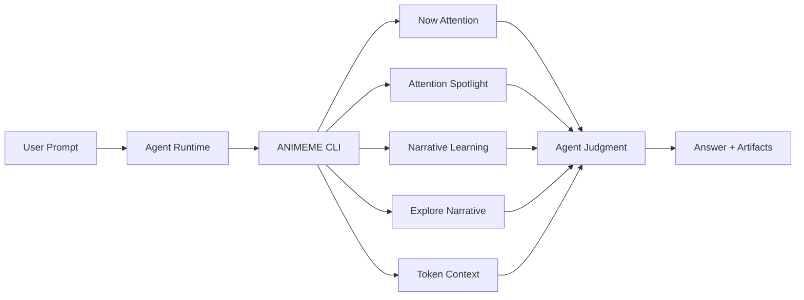
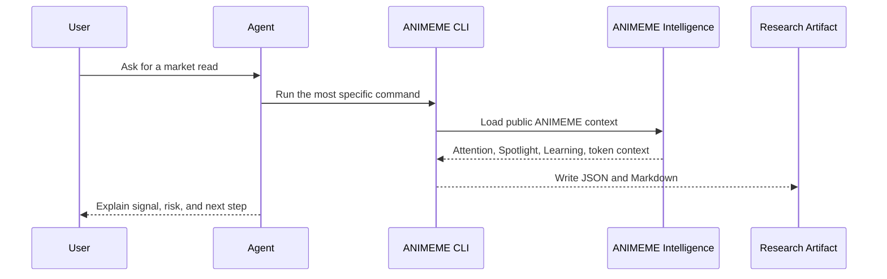
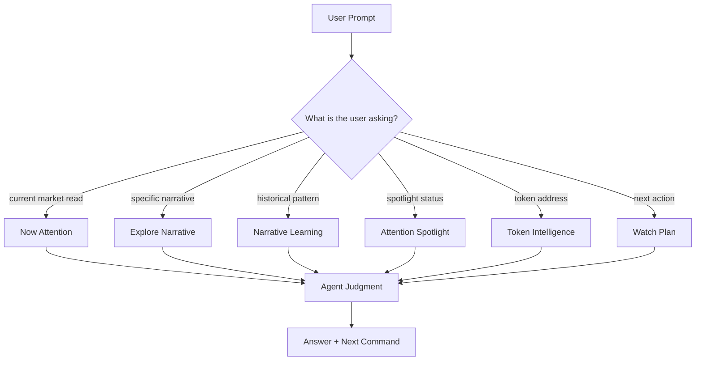
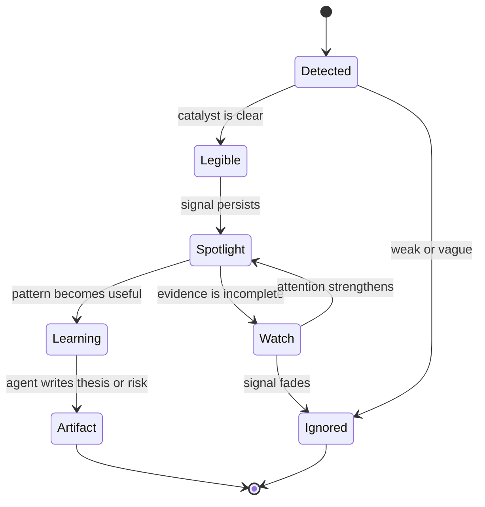
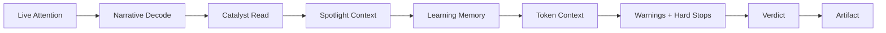
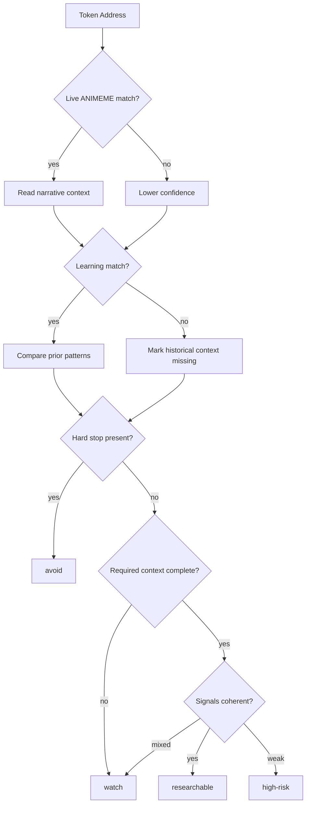
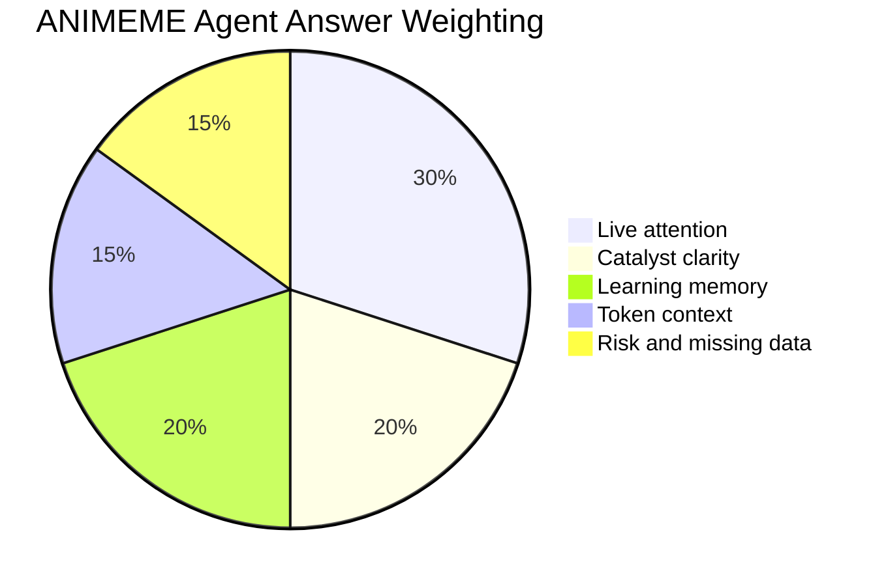
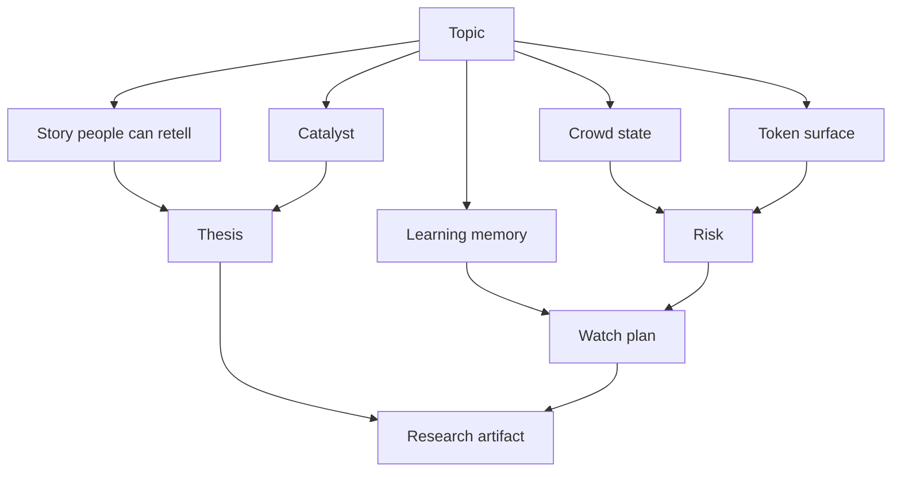
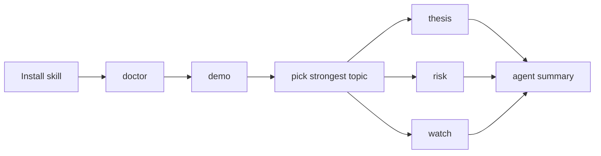

<div align="center">

# ANIMEME Agent Skill

### Charts are late. Memes move first.

ANIMEME Agent Skill is a read-only intelligence layer that lets your agent
study meme attention, narrative formation, spotlight signals, token context,
and historical learning before the chart makes the move obvious.

<br />

<kbd>attention before chart</kbd>
<kbd>meme behind the move</kbd>
<kbd>agent-ready intelligence</kbd>
<kbd>read-only research</kbd>
<kbd>ANIMEME-only public surface</kbd>

<br />
<br />

```bash
npx skills add animeme99/Animeme-Agent
```

<br />

**Product:** [animeme.app](https://animeme.app)  
**Agent Skill:** [github.com/animeme99/Animeme-Agent](https://github.com/animeme99/Animeme-Agent)

</div>

---

## The 10-Second Read

ANIMEME finds the social object behind a token move.

This repo makes that intelligence portable for agents. It gives Codex, Claude
Code, OpenCode, OpenClaw, and other skill-aware runtimes a clear way to ask:

```text
What has attention?
Why is it spreading?
What did ANIMEME learn from similar narratives?
What token context matters?
What is missing?
What should I watch next?
```

ANIMEME Agent Skill is not a trading bot, wallet tool, generic scanner, or
chart dashboard. It is a professional research kit for attention-first meme
intelligence.

---

## What It Feels Like

```text
+----------------------------------------------------------------------------+
| ANIMEME AGENT CONSOLE                                                       |
+----------------------------------------------------------------------------+
| User asks:    "What narrative is trending right now?"                       |
| Agent runs:   npm run answer -- --prompt "What narrative is trending..."    |
|                                                                            |
| ANIMEME returns:                                                           |
|   01. strongest attention read                                             |
|   02. catalyst summary                                                     |
|   03. crowd-state judgment                                                 |
|   04. token context                                                        |
|   05. learning memory                                                      |
|   06. warnings and missing data                                            |
|   07. next research command                                                |
+----------------------------------------------------------------------------+
```

The agent does not dump raw data. It turns ANIMEME context into judgment:

```text
what has attention -> why now -> what confirms it -> what weakens it -> what to inspect next
```

---

## Navigation

| Section | Why It Matters |
| --- | --- |
| [Quick Start](#quick-start) | Install, clone, validate, and run the first demo. |
| [Core Concept](#core-concept) | Understand the ANIMEME intelligence loop. |
| [Graph Gallery](#graph-gallery) | See the routing, lifecycle, pipeline, verdict, and artifact graphs. |
| [Public Surfaces](#public-surfaces) | Learn what Now Attention, Spotlight, Learning, Explore, and Token Intelligence do. |
| [Command Center](#command-center) | Pick the right command for the job. |
| [Demo Playbooks](#demo-playbooks) | Copy professional demo prompts and workflows. |
| [Output Contract](#output-contract) | See what good answers and artifacts look like. |
| [Safety Model](#safety-model) | Understand what the agent will never do. |
| [Documentation Boundary](#documentation-boundary) | Keep public docs ANIMEME-only. |
| [Development](#development) | Extend the kit without weakening the public story. |

---

## Quick Start

### Install As A Skill

```bash
npx skills add animeme99/Animeme-Agent
```

Then ask your agent:

```text
Use the ANIMEME skills. Show me what you can do, then run the default demo flow.
```

### Clone For Local CLI Usage

```bash
git clone https://github.com/animeme99/Animeme-Agent.git
cd Animeme-Agent
npm install
npm run typecheck
npm run doctor
npm run demo
```

If an installed skill folder only contains `SKILL.md`, clone this repository
before running CLI commands. The executable CLI lives at the repository root
and requires `package.json`.

### First Useful Commands

```bash
npm run answer -- --prompt "What narrative is trending right now?"
npm run answer -- --prompt "What is the LUNCHMONEY narrative about?"
npm run answer -- --prompt "Analyze token <token-address>"
npm run answer -- --prompt "Is token <token-address> worth deeper research?"
npm run answer -- --prompt "What is Attention Spotlight showing?"
npm run answer -- --prompt "What should I watch next?"
```

If the local npm shell strips `--prompt`, use the positional form:

```bash
npm run answer -- "What narrative is trending right now?"
```

---

## Core Concept

ANIMEME studies attention before price makes the story obvious.

```text
attention -> legibility -> narrative -> heat confirmation
```

It answers five questions:

| Question | ANIMEME Read |
| --- | --- |
| What has attention right now? | Current live attention board context. |
| Why is this meme spreading? | Catalyst and social object explanation. |
| Has this pattern worked before? | Narrative Learning and historical memory. |
| Is the crowd early or crowded? | Crowd-state and signal interpretation. |
| What should be inspected next? | Thesis, risk, watch, or token research workflow. |

The public agent experience should feel like a professional intelligence desk:
fast, structured, skeptical, and useful.

---

## Intelligence Architecture





---

## Graph Gallery

### Prompt Routing Graph



### Attention Lifecycle



### ANIMEME Research Pipeline



### Token Verdict Decision Graph



### Answer Weighting



### Topic Intelligence Map



### Demo Flow Graph



---

## Public Surfaces

### Now Attention

Now Attention shows what ANIMEME sees in the current attention stream.

| Agent Use | Output |
| --- | --- |
| Rank current Attention Reads | A shortlist of the strongest live topics. |
| Identify the strongest narrative object | A plain-language read of what people are reacting to. |
| Compare new, rising, and viral context | A better sense of timing and crowd state. |
| Separate signal from noise | A cleaner answer than ticker-only scanning. |

### Attention Spotlight

Attention Spotlight tracks the topics ANIMEME believes deserve closer review.

| Agent Use | Output |
| --- | --- |
| Explain why a topic entered Spotlight | First-trigger context and current state. |
| Inspect signal history | What changed after the first attention event. |
| Decide the next workflow | Thesis, risk, watch, or token analysis. |
| Detect crowd-state drift | Early, rising, crowded, weak, or real heat. |

### Narrative Learning

Narrative Learning is ANIMEME's historical memory.

| Agent Use | Output |
| --- | --- |
| Compare a live topic with prior cycles | A stronger read on whether the setup has precedent. |
| Extract repeated archetypes | Themes that keep showing up across attention cycles. |
| Pull operator takeaways | What ANIMEME learned from past winners and failures. |
| Support a thesis | Evidence and historical contrast. |

### Explore Narrative

Explore Narrative lets agents search the narratives ANIMEME has scanned.

| Agent Use | Output |
| --- | --- |
| Search a narrative name | Matching topic memory. |
| Inspect catalyst language | Why the story was legible. |
| Compare topic states | Whether the setup still has attention. |
| Move from curiosity to research | Topic detail, thesis, risk, and watch plan. |

### Token Intelligence

Token Intelligence is ANIMEME's advisory token research workflow.

| Agent Use | Output |
| --- | --- |
| Analyze any token address | Score, verdict, strengths, warnings, hard stops, missing data. |
| Connect a token to live attention | Whether the token is attached to an active narrative. |
| Compare with learning memory | Whether similar setups appeared before. |
| Decide whether to keep researching | Researchable, watch, high-risk, or avoid. |

Token Intelligence is not a trade signal. It is a structured research aid.

---

## Command Center

### Natural-Language Router

Use this when the user does not know which command to run:

```bash
npm run answer -- --prompt "<question>"
```

| Prompt | Route |
| --- | --- |
| `What narrative is trending right now?` | Trending narrative read |
| `What is narrative X about?` | Narrative explanation |
| `Analyze token X` | Token Intelligence |
| `Is token X safe?` | Conservative token due diligence |
| `What is Attention Spotlight showing?` | Spotlight preview |
| `What should I watch next?` | Watch plan |

### High-Level Commands

| Command | Purpose | Best For |
| --- | --- | --- |
| `npm run doctor` | Check runtime readiness and ANIMEME reachability. | Setup validation |
| `npm run demo` | Load a full first-run ANIMEME context bundle. | Onboarding |
| `npm run brief` | Produce a daily-style attention brief. | Operator summaries |
| `npm run context` | Refresh the full ANIMEME context for an agent session. | Longer agent runs |
| `npm run catalog` | Print supported ANIMEME data surfaces and routing. | Choosing a workflow |

### Attention Commands

| Command | Purpose | Best For |
| --- | --- | --- |
| `npm run scan` | Scan current attention boards. | Current heat |
| `npm run hot -- --limit 20` | Rank strongest current topics. | Shortlists |
| `npm run new -- --mode latest` | Inspect new/latest/rising/viral topic context. | Fresh attention |
| `npm run spotlight` | Load Attention Spotlight and recent signal context. | Spotlight review |

### Learning And Topic Commands

| Command | Purpose | Best For |
| --- | --- | --- |
| `npm run learning` | Load learning summary, topics, outcomes, and resources. | Historical patterns |
| `npm run topics -- --search <query>` | Search narrative memory. | Narrative research |
| `npm run topic -- --topic <topic-id>` | Inspect one topic and its signal context. | Deep topic review |

### Token And Artifact Commands

| Command | Purpose | Best For |
| --- | --- | --- |
| `npm run token -- --address <token-address>` | Run fast token analysis. | Quick checks |
| `npm run token:deep -- --address <token-address>` | Run deeper token due diligence. | Safety and conviction review |
| `npm run thesis -- --topic <topic-id>` | Convert a topic into a narrative thesis. | Research notes |
| `npm run risk -- --topic <topic-id>` | Produce a risk checklist for a topic. | Invalidation rules |
| `npm run watch -- --topic <topic-id>` | Produce a watch plan. | Follow-up monitoring |
| `npm run fetch -- --path /api/<animeme-path>` | Fetch an allowed ANIMEME public route. | Advanced read-only inspection |

---

## Demo Playbooks

<details>
<summary><strong>Demo 1: First-Run Agent Onboarding</strong></summary>

```text
Use the ANIMEME skills. Show me what you can do, then run the default demo flow.
```

Expected flow:

```bash
npm run doctor
npm run demo
```

The agent should return:

- what ANIMEME can do
- the strongest current Attention Read
- why it matters
- what could invalidate it
- which artifact command to run next

</details>

<details>
<summary><strong>Demo 2: Current Trending Narrative</strong></summary>

```bash
npm run answer -- --prompt "What narrative is trending right now?"
```

Expected answer:

- direct answer first
- current Attention Read
- catalyst summary
- crowd-state read
- lead token context when available
- warning or missing-data note
- next prompt

</details>

<details>
<summary><strong>Demo 3: Narrative Explanation</strong></summary>

```bash
npm run answer -- --prompt "What is the LUNCHMONEY narrative about?"
```

Expected answer:

- plain-language explanation
- whether the topic is live, stale, or only historical
- ANIMEME learning context
- Spotlight context when available
- what to inspect next

</details>

<details>
<summary><strong>Demo 4: Token Research</strong></summary>

```bash
npm run answer -- --prompt "Analyze token <token-address>"
```

Expected answer:

- score
- verdict
- confidence
- live attention status
- learning status
- token context
- strengths
- warnings
- hard stops
- missing data
- next command

</details>

<details>
<summary><strong>Demo 5: Thesis, Risk, And Watch Bundle</strong></summary>

```bash
npm run scan
npm run thesis -- --topic <topic-id>
npm run risk -- --topic <topic-id>
npm run watch -- --topic <topic-id>
```

Expected output:

- one narrative thesis
- invalidation rules
- hard-stop checklist
- watch conditions
- generated JSON and Markdown artifacts

</details>

---

## Output Contract

Good ANIMEME agent answers follow the same shape:

```text
Verdict: watch
Confidence: medium
Score: 54/100

Why it matters:
- The topic has live ANIMEME attention.
- The narrative is easy to retell.
- The learning match is partial.

Warnings:
- Required context is incomplete.
- Crowd-state confirmation is not fully cleared.

Next:
- Run a thesis on the matched topic.
- Keep the token in watch mode until missing context is resolved.
```

Every good answer should include:

| Field | Required? | Why |
| --- | --- | --- |
| Direct answer | Yes | The user should not wait for the conclusion. |
| ANIMEME context used | Yes | Shows what the agent actually checked. |
| Signal read | Yes | Explains why the topic or token matters. |
| Warnings | Yes | Prevents hype from replacing judgment. |
| Missing data | Yes | Missing data is not bullish. |
| Next command | Yes | Keeps the workflow actionable. |

---

## Artifact Contract

Commands that generate research output write artifacts under `artifacts/`.

```text
artifacts/
  2026-05-01T02-17-52-895Z-token-<address>.json
  2026-05-01T02-17-52-895Z-token-<address>.md
```

| Artifact | Purpose |
| --- | --- |
| JSON | Machine-readable payload for agents, scripts, and audits. |
| Markdown | Human-readable summary for review and sharing. |

Generated artifacts are advisory and user-controlled. The repository ignores
generated artifacts by default, except `artifacts/.gitkeep`.

---

## Token Intelligence Framework

`token:deep` creates an ANIMEME token-intelligence read.

Inputs:

- token address
- live ANIMEME attention match
- ANIMEME topic context
- ANIMEME learning match
- ANIMEME token context
- concentration and crowding signals
- strength, warning, hard-stop, and missing-data checks

Verdicts:

| Verdict | Meaning | Agent Action |
| --- | --- | --- |
| `researchable` | The setup has enough clean context to continue research. | Write thesis, compare with Spotlight, define watch rules. |
| `watch` | The setup is mixed or incomplete. | Keep observing and require more proof. |
| `high-risk` | Attention is weak or safety context is poor/incomplete. | Avoid escalation unless the user has separate evidence. |
| `avoid` | A blocking concentration, manipulation, or integrity risk is present. | Stop escalation and explain the blocking risk. |

Never say a token is guaranteed safe.

---

## Topic Intelligence Framework

Topic-level work is based on attention, narrative readability, flow, token
surface, Spotlight context, and learning memory.

| Dimension | Strong Sign | Weak Sign |
| --- | --- | --- |
| Attention | Repeated board visibility and strong score | One stale appearance |
| Catalyst | Clear reason people can repeat | Vague ticker-only noise |
| Narrative | One-sentence retellability | Confusing context |
| Token Surface | Visible lead token and coherent basket | Broken or scattered token surface |
| Spotlight Context | Has signal history | No Spotlight context |
| Learning Context | Similar prior patterns exist | No historical comparison |
| Risk Context | Warnings are explicit and bounded | Missing data hidden as confidence |

---

## Repository Layout

```text
.
+-- .agents/
|   +-- skills/
|       +-- animeme-data/
|       |   +-- SKILL.md
|       +-- animeme-token-intelligence/
|           +-- SKILL.md
+-- artifacts/
|   +-- .gitkeep
+-- docs/
|   +-- data-catalog.md
|   +-- demo-prompt-playbook.md
|   +-- token-intelligence-playbook.md
+-- memory/
|   +-- README.md
+-- src/
|   +-- CLI, clients, routing, and intelligence logic
+-- AGENTS.md
+-- CLAUDE.md
+-- opencode.json
+-- package.json
+-- tsconfig.json
```

---

## Safety Model

Allowed:

- read ANIMEME public intelligence
- analyze and score
- write generated artifacts
- summarize uncertainty and missing data
- produce thesis, risk, and watch plans

Blocked:

- trade or swap
- sign transactions
- request private keys
- request seed phrases
- store credentials, cookies, exported sessions, or wallet material
- mutate production systems
- claim a token is guaranteed safe

All output is research, not financial advice.

---

## Documentation Boundary

This public repository documents ANIMEME as the only public intelligence
surface.

Public docs must not expose, name, map, or describe non-ANIMEME endpoints.
Agents should treat every workflow as ANIMEME intelligence unless a local
operator has separately configured private enrichment outside the public
documentation surface.

Allowed public language:

- ANIMEME public intelligence
- ANIMEME live attention
- ANIMEME token context
- ANIMEME narrative memory
- ANIMEME spotlight signals
- ANIMEME learning archive
- ANIMEME artifact output

Avoid public documentation that exposes:

- non-ANIMEME endpoint URLs
- non-ANIMEME route paths
- non-ANIMEME credential names
- adapter internals
- private infrastructure topology
- account, wallet, signing, or trading instructions

The public story is simple: agents connect to ANIMEME, ANIMEME returns
structured attention intelligence, and the agent turns that intelligence into a
clear research answer.

---

## Development

```bash
npm install
npm run typecheck
npm run doctor
npm run demo
npm run token:deep -- --address <token-address>
```

When extending the kit:

- keep public docs ANIMEME-only
- add new workflows through the CLI before documenting them
- keep generated files under `artifacts/`
- document user-facing behavior in `README.md`, `AGENTS.md`, and `docs/`
- do not expose non-ANIMEME endpoint details in public docs
- keep every workflow read-only unless the product explicitly changes scope

---

## FAQ

<details>
<summary><strong>Is this the ANIMEME product?</strong></summary>

No. The product is [animeme.app](https://animeme.app). This repository is the
public Agent Skill and read-only CLI layer.

</details>

<details>
<summary><strong>Does this trade?</strong></summary>

No. It is read-only.

</details>

<details>
<summary><strong>Does this need wallet credentials?</strong></summary>

No. Never provide private keys, seed phrases, exported sessions, or wallet
material.

</details>

<details>
<summary><strong>Can agents fetch arbitrary websites?</strong></summary>

No. Public fetch workflows are constrained to ANIMEME public intelligence.

</details>

<details>
<summary><strong>What happens when data is missing?</strong></summary>

The CLI reports missing data explicitly and lowers confidence. Missing data is
never treated as bullish.

</details>

<details>
<summary><strong>Is the score financial advice?</strong></summary>

No. The score is an agent research heuristic for deciding what to inspect next.

</details>

---

## Short Version

```bash
npx skills add animeme99/Animeme-Agent
git clone https://github.com/animeme99/Animeme-Agent.git
cd Animeme-Agent
npm install
npm run doctor
npm run demo
npm run token:deep -- --address <token-address>
```

ANIMEME Agent Skill brings public ANIMEME intelligence into your own agent so
it can explain attention, catalyst, crowd state, confirmation, and risk before
the chart makes the move obvious.
