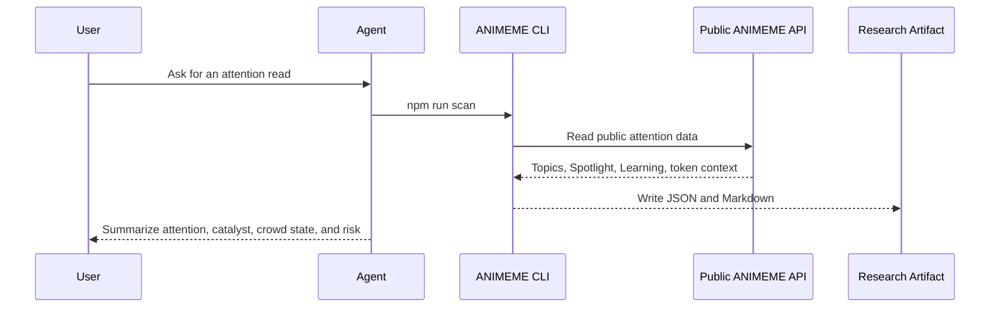

# ANIMEME Agent Skill

ANIMEME is pre-chart meme intelligence for Solana trenches.

Charts are late. Memes move first. ANIMEME finds the meme behind the move.

This repository makes ANIMEME public intelligence portable. It gives a
user-controlled agent read-only access to public attention boards, spotlight
signals, learning summaries, searchable narrative memory, token context, and
timestamped research artifacts. It also includes direct read-only access paths
for GMGN token metrics and Binance public market/Web3 data.

```bash
npx skills add animeme99/Animeme-Agent
```

After install, the easiest agent prompt is:

```text
Use the ANIMEME skills. Run the doctor check, then run the demo brief and tell
me the strongest topic, lead token, risk, and next command.
```

For video demos or natural-language agent use, the easiest CLI command is:

```bash
npm run answer -- --prompt "Trending Narrative hiện là gì?"
npm run answer -- --prompt "Narrative LUNCHMONEY nói về cái gì?"
npm run answer -- --prompt "Phân tích token <solana-token-address>"
```

The Agent Skill is a support layer. The core product remains
[animeme.app](https://animeme.app): live pre-chart meme intelligence.

## Public Links

- Product: [animeme.app](https://animeme.app)
- GitHub: [animeme99/Animeme-Agent](https://github.com/animeme99/Animeme-Agent)
- X: [@Animemeapp](https://x.com/Animemeapp)
- Telegram: [Animeme_AI](https://t.me/Animeme_AI)

## What ANIMEME Does

ANIMEME reads live Solana trench attention before the chart makes the move
obvious.

It answers five questions:

1. What are trenches paying attention to right now?
2. Why is this meme or narrative spreading?
3. What catalyst made the attention legible?
4. Has this pattern worked before?
5. Is the crowd early, rising, crowded, weak, or becoming real heat?

The product sequence is:

```text
attention -> legibility -> narrative -> heat confirmation
```

## What This Repo Does

This repo lets an agent reuse ANIMEME public intelligence without private
keys, wallet credentials, or production access. Complete token due diligence
also uses a user-provided `GMGN_API_KEY` for direct GMGN market metrics.

It can:

- scan Now Attention for current Attention Reads
- explain Attention Spotlight and recent signal history
- search Narrative Learning and Explore Narrative memory
- inspect topic detail and public source context
- analyze a token address against live attention, direct GMGN API-key metrics,
  and Animeme market fallback data
- fetch direct GMGN token metrics with `GMGN_API_KEY`
- fetch Binance Spot public market data and Binance Web3 public token data
- write JSON and Markdown artifacts under `artifacts/`
- expose reusable skills under `.agents/skills/`

It does not:

- trade
- sign transactions
- request wallet keys
- create tokens
- mutate ANIMEME production data
- call Binance account, order, or signed trading endpoints
- turn a score into financial advice

## Install As A Skill

Use this when your agent supports skill installation:

```bash
npx skills add animeme99/Animeme-Agent
```

The repo exposes two skills:

```text
.agents/skills/animeme-data/SKILL.md
.agents/skills/animeme-token-intelligence/SKILL.md
```

`animeme-data` is the default skill for public data workflows.

`animeme-token-intelligence` is the deeper due-diligence skill for token safety,
crowding, holder quality, manipulation risk, and conviction review.

## Clone And Run

```bash
git clone https://github.com/animeme99/Animeme-Agent.git
cd Animeme-Agent
npm install
npm run typecheck
npm run doctor
npm run demo
```

If an installed skill folder only contains `SKILL.md`, clone this GitHub repo
before running token or data commands. The executable CLI lives in this repo
root and requires `package.json`.

## GMGN API Key For Token Analysis

`token` and `token:deep` always combine Animeme trending data with GMGN token
metrics. Complete token due diligence requires one of these local settings:

```bash
export GMGN_API_KEY="<your-gmgn-openapi-key>"
```

or:

```text
~/.config/gmgn/.env
GMGN_API_KEY=<your-gmgn-openapi-key>
```

`npm run doctor` reports whether the key is configured, but never prints or
writes the key. If GMGN metrics are missing, `token:deep` marks the analysis
incomplete, lowers confidence, and does not clear holder, insider, or bundler
hard-stop checks.

## Provider Access

The CLI gives agents three read-only data lanes:

```bash
npm run fetch -- --path /api/learning/topics?pageSize=5
npm run gmgn -- --address <solana-token-address>
npm run binance -- --symbol SOLUSDT
npm run binance:spot -- --path /api/v3/ticker/price --symbol SOLUSDT
npm run binance:web3 -- --mode search --keyword SOL --chain-ids CT_501
```

Animeme access is limited to public `/api/*` paths. GMGN access requires
`GMGN_API_KEY`. Binance commands use public Spot and Web3 market endpoints and
do not require Binance account credentials.

## Natural-Language Demo Prompts

Use `answer` when the user asks in normal language and you want a polished
response without manually choosing commands:

```bash
npm run answer -- --prompt "Phân tích token 3vH3NzuHafRNvwKKzoGTWNuLtg5Kc38BxsmfUwgPpump"
npm run answer -- --prompt "Trending Narrative hiện là gì?"
npm run answer -- --prompt "Narrative LUNCHMONEY nói về cái gì?"
npm run answer -- --prompt "Token <address> có an toàn không?"
npm run answer -- --prompt "GMGN và Binance data của <address>"
```

If the local npm shell strips `--prompt`, use the positional form:

```bash
npm run answer -- "Trending Narrative hiện là gì?"
```

Routing behavior:

- Token prompts load Animeme Now Attention, Narrative Learning, direct GMGN
  API-key metrics, Animeme market fallback data, and Binance public Spot/Web3
  context.
- Trending prompts rank the live Now Attention board and return demo follow-up
  prompts.
- Narrative prompts search live topics plus Narrative Learning and include
  Spotlight signal keys when a live topic is matched.
- Spotlight prompts return the current Spotlight preview and recent performance
  notifications.
- Provider prompts keep Animeme, GMGN, and Binance sections separate so missing
  data is visible.

## First Prompt After Install

Ask the agent:

```text
Use the ANIMEME skills. Show me what you can do, then run the default demo flow.
```

Expected capability menu:

```text
ANIMEME Agent Skill can help with:
1. Scan what has attention now.
2. Explain Attention Spotlight.
3. Search Narrative Learning.
4. Analyze a token address.
5. Produce thesis, risk, and watch artifacts.

Default demo:
- Run npm run doctor.
- If this folder only has SKILL.md, clone https://github.com/animeme99/Animeme-Agent first.
- Run npm run demo.
- Pick the strongest Attention Read from the demo or scan.
- Run npm run thesis -- --topic <topic-id>.
- Run npm run risk -- --topic <topic-id>.
- Summarize the artifact files created under artifacts/.
```

For token due diligence:

```text
Use animeme-token-intelligence.
Run npm run token:deep -- --address <token-address>.
Explain the score, warnings, hard stops, and missing data.
```

The CLI also accepts the token as a positional argument, which helps in npm
environments that strip flags:

```bash
npm run token:deep -- <token-address>
```

## Public Surfaces

### Now Attention

Shows what Solana trenches are paying attention to right now.

Agent use:

- scan live boards
- identify active Attention Reads
- compare live flow and topic movement
- find catalyst, token surface, and crowd-state hints

### Attention Spotlight

Tracks live Attention Reads from first trigger through catalyst, crowd state,
flow, and heat confirmation.

Agent use:

- explain why a topic entered Spotlight
- compare first trigger to current state
- inspect signal history for one topic
- separate early heat from crowded risk or weak follow-through

### Narrative Learning

Shows what ANIMEME has learned from past attention cycles.

Agent use:

- retrieve historical winners and repeated patterns
- compare a live setup against known archetypes
- extract proof-backed learning and operator takeaways

### Explore Narrative

Searches the narratives ANIMEME has scanned.

Agent use:

- search topic memory
- inspect catalysts, themes, crowd states, and token confirmation
- open topic detail for deeper research

## Command Matrix

| Command | Purpose | Output |
| --- | --- | --- |
| `npm run answer -- --prompt "<question>"` | Route natural-language demo prompts to token, trending, narrative, provider, or doctor answers. | Prompt answer artifact |
| `npm run doctor` | Check local runtime and public API reachability. | Doctor artifact |
| `npm run demo` | First-run bundle for new users: attention, spotlight, learning, resources, and next commands. | Full public context artifact |
| `npm run brief` | Daily public context brief for operator-style use. | Full public context artifact |
| `npm run context` | Refresh full public context for an agent session. | Full public context artifact |
| `npm run catalog` | Print the public data catalog and endpoint use cases. | JSON + Markdown |
| `npm run gmgn -- --address <token>` | Fetch direct GMGN API-key token metrics. | GMGN artifact |
| `npm run binance -- --symbol SOLUSDT` | Load Binance Spot market bundle, optionally with Web3 token data. | Binance bundle artifact |
| `npm run binance:spot -- --path /api/v3/ticker/price --symbol SOLUSDT` | Fetch an allowlisted Binance Spot public endpoint. | Raw Binance Spot artifact |
| `npm run binance:web3 -- --mode search --keyword SOL --chain-ids CT_501` | Fetch Binance Web3 public token search/meta/dynamic/kline data. | Raw Binance Web3 artifact |
| `npm run scan` | Scan current attention boards. | Hot topic artifact |
| `npm run hot -- --limit 20` | Rank the strongest current topics. | Hot topic artifact |
| `npm run new -- --mode latest` | Inspect new/latest topic flow. | Mode artifact |
| `npm run spotlight` | Load Attention Spotlight and recent signal context. | Spotlight artifact |
| `npm run learning` | Load learning summary, topics, outcomes, and resources. | Learning artifact |
| `npm run topics -- --search <query>` | Search narrative memory. | Topic-list artifact |
| `npm run topic -- --topic <topic-id>` | Inspect one topic and its signal context. | Topic artifact |
| `npm run token -- --address <token>` | Run a fast token analysis. | Token artifact |
| `npm run token:deep -- --address <token>` | Run deeper token due diligence. | Token intelligence artifact |
| `npm run fetch -- --path /api/<path>` | Fetch any allowed public ANIMEME API path. | Raw fetch artifact |
| `npm run thesis -- --topic <topic-id>` | Convert a topic into a narrative thesis. | Thesis artifact |
| `npm run risk -- --topic <topic-id>` | Produce a risk checklist for a topic. | Risk artifact |
| `npm run watch -- --topic <topic-id>` | Produce a watch plan. | Watch artifact |

## Data Planes

| Plane | Public route family | What it answers | Main commands |
| --- | --- | --- | --- |
| Live Attention | `/api/now-attention-feed` | What has attention now? What is new? Which topics have live flow? | `demo`, `brief`, `scan`, `hot`, `new` |
| Spotlight | `/api/spotlight`, `/api/spotlight-topic-signals` | Why this, why now, and what happened since first trigger? | `demo`, `brief`, `spotlight`, `topic` |
| Learning | `/api/learning/*` | What patterns worked before? Which topics repeated? What did ANIMEME learn? | `demo`, `brief`, `learning`, `topics`, `topic` |
| Market Metrics | GMGN OpenAPI via `GMGN_API_KEY`, plus `/api/market/token-metrics` fallback | Is this token crowded, manipulated, or worth deeper research? | `token`, `token:deep` |
| GMGN Raw | `https://openapi.gmgn.ai/v1/token/info` | What does direct GMGN report for this Solana token? | `gmgn`, `token`, `token:deep` |
| Binance Spot | public `https://api.binance.com/api/v3/*` allowlist | What are centralized market price, ticker, depth, trades, and kline data? | `binance`, `binance:spot` |
| Binance Web3 | public Binance Web3 token endpoints | What are token search, metadata, dynamic market, holder, and kline fields? | `binance`, `binance:web3` |
| Raw API | public `/api/*` allowlist | Let advanced agents inspect new public endpoints without code changes. | `fetch` |

## Intelligence Loop



The agent should always compress public data into judgment:

```text
what has attention
why now
what confirms it
what weakens it
what to inspect next
```

## Token Intelligence

`token:deep` creates an ANIMEME token-intelligence read. It is a research
heuristic, not a trading signal.

Inputs:

- live attention match
- learning archive match
- GMGN API-key market metrics
- Animeme public market fallback metrics
- holder concentration
- creator/dev concentration
- insider pressure
- bundled activity
- fresh-wallet mix
- smart holder and KOL holder context

Verdicts:

| Verdict | Meaning | Agent action |
| --- | --- | --- |
| `researchable` | Enough clean signals to continue deeper research. | Write thesis, compare with Spotlight, watch for persistence. |
| `watch` | Mixed or incomplete context. | Keep observing and require more proof. |
| `high-risk` | Weak attention or poor/missing metrics. | Avoid escalation unless the user has separate evidence. |
| `avoid` | Hard-stop concentration or manipulation risk. | Stop escalation and explain the blocking risk. |

## Topic Intelligence

Topic-level work is based on live attention, narrative readability, flow, token
surface, and historical context.

| Dimension | Strong sign | Weak sign |
| --- | --- | --- |
| Attention | High score, live board visibility, repeated board presence | Single stale appearance |
| Flow | Positive inflow or strong topic movement | No flow or negative flow without explanation |
| Narrative | Easy to summarize in one sentence | Ticker spam or unclear context |
| Token surface | Several visible tokens with a lead token | No token surface or broken metadata |
| Spotlight context | Has Spotlight history | No Spotlight context |
| Learning context | Similar past topics exist | No learning pattern |

## Prompt Recipes

### Daily Attention Brief

```text
Load AGENTS.md and the animeme-data skill.
Run npm run brief.
Summarize the top 5 Attention Reads, explain why each is moving, and write a
watch plan for the strongest topic.
```

### Token Safety Review

```text
Load animeme-data and animeme-token-intelligence.
Run npm run token:deep -- --address <token-address>.
Explain the score, warnings, hard stops, and what data is missing.
Do not recommend execution.
```

### Narrative Thesis

```text
Run npm run scan.
Pick the strongest topic with clear narrative context.
Run npm run thesis -- --topic <topic-id> and npm run risk -- --topic <topic-id>.
Return the thesis, invalidation rules, and watch conditions.
```

### Raw Research

```text
Run npm run catalog.
Pick the most relevant public endpoint.
Run npm run fetch -- --path /api/<path>.
Summarize only the fields that matter for the user's question.
```

### Provider Data Check

```text
Run npm run doctor.
Run npm run gmgn -- --address <token-address>.
Run npm run binance -- --symbol SOLUSDT --address <token-address>.
Summarize Animeme, GMGN, and Binance data separately.
```

## Artifact Contract

Every command writes generated artifacts:

```text
artifacts/
  2026-04-24T02-17-52-895Z-token-<address>.json
  2026-04-24T02-17-52-895Z-token-<address>.md
```

Artifacts are intentionally advisory and user-controlled.

| Artifact | Purpose |
| --- | --- |
| JSON | Machine-readable payload for agents, scripts, and audits. |
| Markdown | Human-readable summary for review and sharing. |

The repo ignores generated artifacts by default, except `artifacts/.gitkeep`.

## Repository Layout

```text
.
+-- .agents/
|   +-- skills/
|       +-- animeme-data/
|       |   +-- SKILL.md
|       +-- animeme-token-intelligence/
|           +-- SKILL.md
+-- artifacts/
|   +-- .gitkeep
+-- docs/
|   +-- data-catalog.md
|   +-- demo-prompt-playbook.md
|   +-- token-intelligence-playbook.md
+-- memory/
|   +-- README.md
+-- src/
|   +-- animeme-client.ts
|   +-- binance-client.ts
|   +-- cli.ts
|   +-- gmgn-client.ts
|   +-- token-intelligence.ts
+-- AGENTS.md
+-- CLAUDE.md
+-- opencode.json
+-- package.json
+-- tsconfig.json
```

## Public API Contract

The client only accepts public ANIMEME API paths under `/api/*`.

| Endpoint | Command |
| --- | --- |
| `/api/now-attention-feed?modes=rising,latest,viral` | `demo`, `brief`, `scan`, `hot`, `new` |
| `/api/spotlight?limit=15&historyLimit=30` | `demo`, `brief`, `spotlight` |
| `/api/spotlight-topic-signals?topicIds=<topic-id>` | `topic` |
| `/api/spotlight-performance-notifications` | `demo`, `brief`, `spotlight` |
| `/api/learning/summary` | `demo`, `brief`, `learning` |
| `/api/learning/topics` | `demo`, `brief`, `learning`, `topics`, `token`, `token:deep` |
| `/api/learning/topics/<topic-id>` | `topic` |
| `/api/learning/key-resources` | `demo`, `brief`, `learning` |
| `/api/learning/spotlight-outcomes` | `demo`, `brief`, `learning` |
| `/api/learning/attention-distribution` | `demo`, `brief`, `learning` |
| `/api/market/token-metrics?addresses=<address>` | `token`, `token:deep` |

Direct GMGN OpenAPI is used only by the local CLI when `GMGN_API_KEY` is
configured. It is not an Animeme public `/api/*` route and the key must never be
committed, printed, or copied into artifacts.

## Provider API Contract

GMGN:

- `GET https://openapi.gmgn.ai/v1/token/info?chain=sol&address=<address>`
- Header: `X-APIKEY: <GMGN_API_KEY>`
- Commands: `gmgn`, `token`, `token:deep`

Binance Spot public allowlist:

- `/api/v3/exchangeInfo`
- `/api/v3/ping`
- `/api/v3/time`
- `/api/v3/avgPrice`
- `/api/v3/depth`
- `/api/v3/klines`
- `/api/v3/ticker`
- `/api/v3/ticker/24hr`
- `/api/v3/ticker/bookTicker`
- `/api/v3/ticker/price`
- `/api/v3/ticker/tradingDay`
- `/api/v3/trades`
- `/api/v3/aggTrades`
- `/api/v3/uiKlines`

Binance Web3 public modes:

- `search`: keyword token search across `56`, `8453`, and `CT_501`
- `meta`: token metadata by `chainId` and contract address
- `dynamic`: token market, holder, liquidity, and volume fields
- `kline`: token candle data by platform and address

## Reliability Model

The CLI is intentionally conservative:

- non-JSON responses become explicit warnings
- missing market metrics do not become bullish
- missing GMGN API-key metrics make `token:deep` incomplete
- provider fetches write missing-data warnings instead of inventing fields
- missing attention context lowers confidence
- hard stops override attractive narratives
- every report stays advisory

## Safety Model

Allowed:

- read public ANIMEME data
- read direct GMGN token metrics with a user-provided API key
- read Binance public Spot/Web3 market data
- analyze and score
- write generated artifacts
- summarize uncertainty and missing data

Blocked:

- trade or swap
- sign transactions
- request private keys
- store credentials, cookies, exported sessions, or wallet material
- mutate production systems
- use Binance account/order endpoints
- claim a token is guaranteed safe

All output is research, not financial advice.

## Memory Policy

`memory/` is for user-created notes from future agent runs. Do not backfill
older sessions. Do not store secrets.

## Development

```bash
npm install
npm run typecheck
npm run doctor
npm run demo
npm run token:deep -- --address <token-address>
npm run binance -- --symbol SOLUSDT
```

When extending the kit:

- add public data routes in `src/animeme-client.ts`
- add analysis logic under `src/`
- expose commands through `src/cli.ts` and `package.json`
- document workflows in `AGENTS.md`, `.agents/skills/*/SKILL.md`, and `docs/`
- keep public docs branded as ANIMEME public intelligence

## FAQ

### Is this the ANIMEME product?

No. The product is [animeme.app](https://animeme.app). This repo is the public
Agent Skill and read-only CLI layer.

### Does this trade?

No. It is read-only.

### Does this need wallet credentials?

No wallet credentials are needed. Complete token analysis can use a read-only
`GMGN_API_KEY`; never provide private keys or seed phrases.

### Can agents fetch arbitrary websites?

No. Raw fetch is constrained to public ANIMEME `/api/*`, direct GMGN token
metrics, and allowlisted Binance public Spot/Web3 endpoints.

### What happens when data is missing?

The CLI reports missing data explicitly and lowers confidence. Missing data is
never treated as bullish. If GMGN API-key metrics are missing, `token:deep`
stays incomplete even when Animeme trending data is present.

### Is the score financial advice?

No. The score is an agent research heuristic for deciding what to inspect next.

## Short Version

```bash
npx skills add animeme99/Animeme-Agent
git clone https://github.com/animeme99/Animeme-Agent.git
cd Animeme-Agent
npm install
npm run doctor
npm run demo
npm run token:deep -- --address <token-address>
```

ANIMEME Agent Skill brings public ANIMEME intelligence into your own agent so
it can explain attention, catalyst, crowd state, confirmation, and risk before
the chart makes the move obvious.
