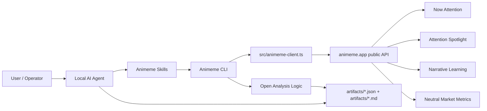
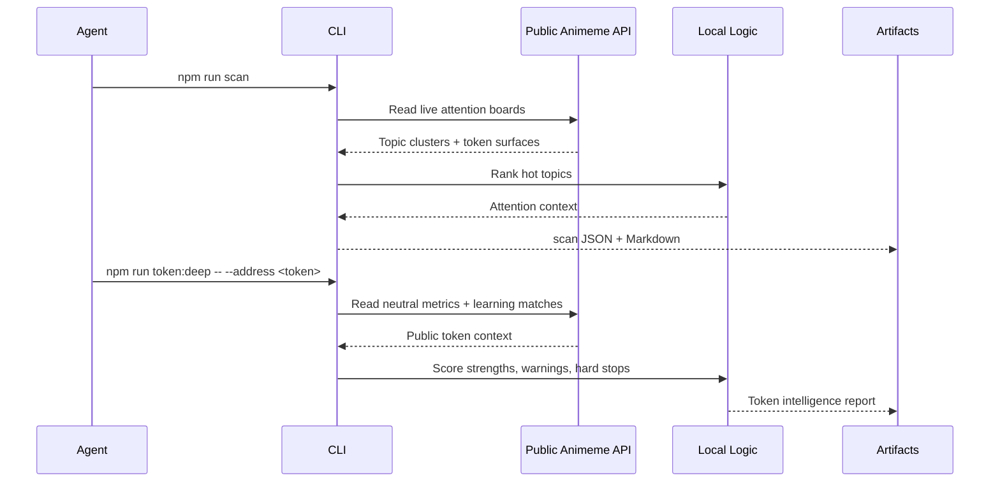
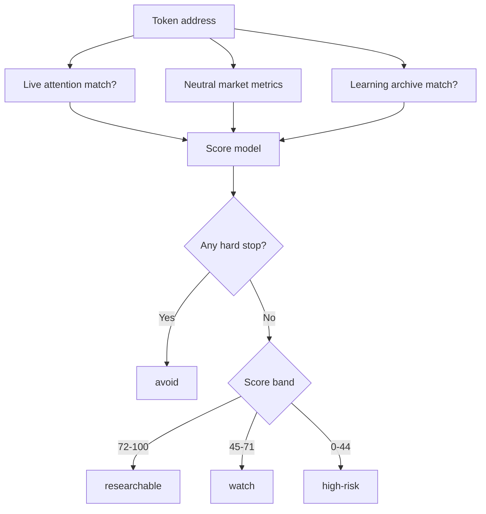
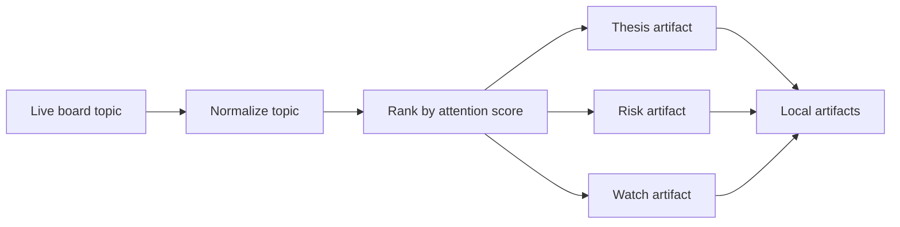
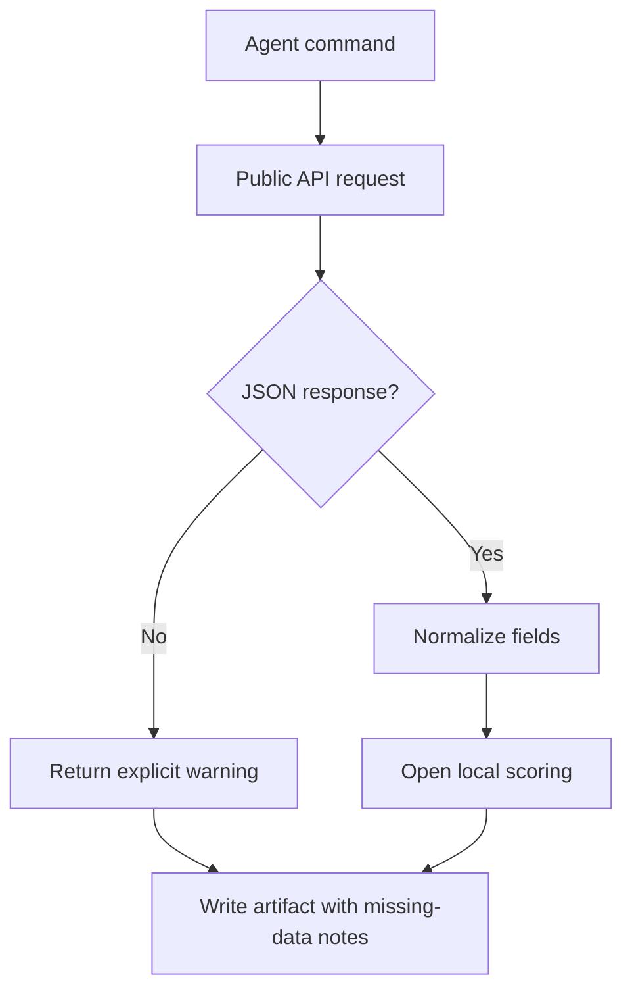
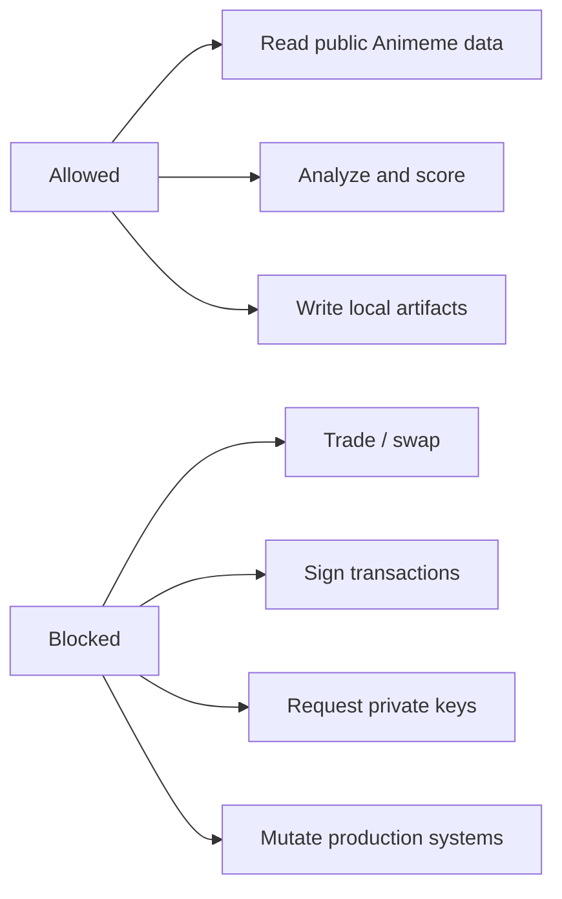

# Animeme Agent


**One clone, all public Animeme data.**

Animeme Agent is a local, read-only intelligence kit for agents that need to
understand meme attention in real time. Clone it, install dependencies, and let
Codex, Claude Code, OpenCode, or any agent-compatible runtime scan live
attention, inspect Spotlight, query narrative learning, analyze token addresses,
and publish structured research artifacts.

This repo is designed for agent mode first. The default output is not a landing
page, not a wallet, and not an execution bot. It is an intelligence workbench
for turning public Animeme data into local research decisions.

```bash
npx skills add 0xchalker/Animeme-Agent
```

```bash
git clone https://github.com/0xchalker/Animeme-Agent.git
cd Animeme-Agent
npm install
npm run typecheck
npm run scan
```

## What This Is

Animeme Agent gives local agents a shared operating layer over Animeme public
data:

- Live Now Attention boards: `rising`, `latest`, `viral`.
- Attention Spotlight and performance notifications.
- Narrative Learning summaries, topic archive, resources, outcomes, and
  attention distribution.
- Token-level Animeme Intelligence scoring from neutral market metrics.
- Raw public `/api/*` fetch access for power users.
- Local JSON and Markdown artifacts under `artifacts/`.
- Agent instructions for Codex, Claude Code, and OpenCode.

It is intentionally read-only. No command in this repo signs transactions,
requests wallet keys, creates tokens, executes swaps, mutates Animeme state, or
requires private credentials.

## System Map



## Intelligence Loop

The core loop is simple: observe, score, decide, and write down the decision.



## Data Planes

| Plane | Public route family | What it answers | Main commands |
| --- | --- | --- | --- |
| Live Attention | `/api/now-attention-feed` | What is hot now? What is new? Which topic has live flow? | `scan`, `hot`, `new` |
| Spotlight | `/api/spotlight`, `/api/spotlight-topic-signals` | What did Animeme spotlight? What is the current signal history? | `spotlight`, `topic` |
| Learning | `/api/learning/*` | What patterns worked before? Which topics repeated? What should an agent learn? | `learning`, `topics`, `topic` |
| Market Metrics | `/api/market/token-metrics` | Is this token crowded, manipulated, or worth deeper research? | `token`, `token:deep` |
| Raw API | any public `/api/*` path | Let advanced agents inspect new public endpoints without code changes. | `fetch` |

## Install As A Skill

Use this when the agent supports local skills:

```bash
npx skills add 0xchalker/Animeme-Agent
```

The repo exposes two public-facing skills:

```text
.agents/skills/animeme-data/SKILL.md
.agents/skills/animeme-token-intelligence/SKILL.md
```

`animeme-data` is the default skill for public data workflows.

`animeme-token-intelligence` is the deeper due-diligence skill for token safety,
crowding, holder quality, manipulation risk, and conviction review.

## Clone And Run

```bash
git clone https://github.com/0xchalker/Animeme-Agent.git
cd Animeme-Agent
npm install
npm run typecheck
npm run catalog
npm run scan
```

Use a local Animeme web server while developing:

```bash
ANIMEME_API_BASE_URL=http://127.0.0.1:3000 npm run scan
```

PowerShell:

```powershell
$env:ANIMEME_API_BASE_URL="http://127.0.0.1:3000"
npm run scan
Remove-Item Env:\ANIMEME_API_BASE_URL
```

## Command Matrix

| Command | Purpose | Output |
| --- | --- | --- |
| `npm run catalog` | Print the public data catalog and endpoint use cases. | JSON + Markdown |
| `npm run scan` | Scan current rising/latest/viral attention. | Hot topic artifact |
| `npm run hot -- --limit 20` | Rank the strongest current topics. | Hot topic artifact |
| `npm run new -- --mode latest` | Inspect new/latest topic flow. | Mode artifact |
| `npm run spotlight` | Load canonical Attention Spotlight. | Spotlight artifact |
| `npm run learning` | Load learning summary, topics, outcomes, resources, distribution. | Learning artifact |
| `npm run topics -- --search <query>` | Search the narrative learning archive. | Topic-list artifact |
| `npm run topic -- --topic <topic-id>` | Inspect one topic and its signal context. | Topic artifact |
| `npm run token -- --address <token>` | Run a fast token analysis. | Token artifact |
| `npm run token:deep -- --address <token>` | Run deep Animeme Intelligence due diligence. | Token intelligence artifact |
| `npm run fetch -- --path /api/<path>` | Fetch any public Animeme API path. | Raw fetch artifact |
| `npm run thesis -- --topic <topic-id>` | Convert a topic into a narrative thesis. | Thesis artifact |
| `npm run risk -- --topic <topic-id>` | Produce a risk checklist for a topic. | Risk artifact |
| `npm run watch -- --topic <topic-id>` | Produce a local watch plan. | Watch artifact |

## Token Intelligence Engine

`token:deep` creates an Animeme Intelligence Score. It is a research score, not
a trading signal.



### Scoring Inputs

| Signal | Strength | Warning | Hard stop |
| --- | --- | --- | --- |
| Live attention | Topic is currently on Animeme boards | No live attention match | none |
| Learning context | Similar topic exists in learning archive | No learning context | none |
| Top-10 holder share | Under 20% | Above 20% | Above 50% |
| Creator/dev share | Under 10% | Above 10% | Above 30% |
| Insider pressure | Under 10% | Above 10% | Above 30% |
| Bundled activity | Under 15% | Above 15% | Above 35% |
| Fresh-wallet mix | Under 70% | Above 70% | none |
| Smart holders | 3 or more | 0 to 2 | none |
| KOL holders | 1 or more | none | none |

### Verdict Bands

| Verdict | Meaning | Agent action |
| --- | --- | --- |
| `researchable` | Enough clean signals to continue deeper research. | Write thesis, compare with Spotlight, watch for persistence. |
| `watch` | Mixed or incomplete context. | Keep observing; do not escalate without more proof. |
| `high-risk` | Weak attention and poor or missing metrics. | Avoid unless user has a separate thesis. |
| `avoid` | Hard-stop concentration or manipulation risk. | Stop escalation and explain the blocking risk. |

### Pseudocode

```ts
score = 50

if live_attention_match:
  score += 16
else:
  score -= 8

if learning_match:
  score += 8

if neutral_metrics_missing:
  score -= 12

apply concentration penalties
apply creator/dev penalties
apply insider pressure penalties
apply bundled activity penalties
apply fresh-wallet warning
apply smart-holder confidence bonus
apply KOL reach bonus

if hard_stop:
  verdict = "avoid"
else if score >= 72:
  verdict = "researchable"
else if score >= 45:
  verdict = "watch"
else:
  verdict = "high-risk"
```

## Example Token Report

```text
# Animeme Token Analysis: <token-address>

Generated: 2026-04-24T02:17:52.820Z
Attention context: 2026-04-24T02:09:33.902Z
Animeme Intelligence Score: 63/100 (watch, medium confidence)

## Live Attention Matches
- No live Now Attention topic currently links this address.

## Market Metrics
- Top 10 holder share: 1.06
- Fresh wallet share: 0
- Insider share: 0
- Smart holders: 0
- KOL holders: 0

## Intelligence Read
- Verdict: watch
- Confidence: medium
- Score: 63/100
- Strength: Neutral market metrics are available.
- Warning: No live Animeme attention topic currently links this token.
- Warning: No smart holders detected in the neutral metrics snapshot.
```

## Topic Intelligence

Topic-level work is based on live attention, narrative readability, flow,
token surface, and historical context.



### Topic Rubric

| Dimension | Good sign | Weak sign |
| --- | --- | --- |
| Attention | High score, live board visibility, repeated board presence | Single stale appearance |
| Flow | Positive 1h inflow or strong topic movement | No flow or negative flow without explanation |
| Narrative | Easy to summarize in one sentence | Ticker spam or unclear context |
| Token surface | Several visible tokens with a lead token | No token surface or broken metadata |
| Spotlight context | Has canonical Spotlight history | No Spotlight context |
| Learning context | Similar past topics exist | No learning pattern |

## Agent Modes

### Agent Mode

Use this mode when the user wants Codex, Claude Code, OpenCode, or another
local agent to act as an analyst.

Recommended loop:

```bash
npm run scan
npm run spotlight
npm run learning
npm run token:deep -- --address <token-address>
npm run thesis -- --topic <topic-id>
npm run risk -- --topic <topic-id>
npm run watch -- --topic <topic-id>
```

### Human Mode

Use this mode when the user wants a short manual read:

```bash
npm run scan
npm run token -- --address <token-address>
```

The agent should summarize:

- What is moving now.
- Why it matters.
- What is missing.
- What would invalidate the thesis.
- Which command to run next.

## Codex, Claude Code, OpenCode

Codex:

```bash
codex "Use AGENTS.md, load animeme-data and animeme-token-intelligence, run npm run scan, then analyze the strongest topic."
```

Claude Code:

```bash
claude "Read CLAUDE.md, load the Animeme skills, run npm run token:deep -- --address <token-address>."
```

OpenCode:

```bash
opencode
```

OpenCode reads `opencode.json` and can run the approved read-only scripts.

## Prompt Recipes

Use these prompts inside your local agent runtime.

### Daily Attention Brief

```text
Load AGENTS.md and the animeme-data skill.
Run npm run scan, npm run spotlight, and npm run learning.
Summarize the top 5 topics, explain why each is moving, and write a watch plan
for the strongest topic.
```

### Token Safety Review

```text
Load animeme-data and animeme-token-intelligence.
Run npm run token:deep -- --address <token-address>.
Explain the score, warnings, hard stops, and what data is missing.
Do not recommend execution.
```

### Narrative Thesis

```text
Run npm run scan.
Pick the strongest topic with clear narrative context.
Run npm run thesis -- --topic <topic-id> and npm run risk -- --topic <topic-id>.
Return the thesis, invalidation rules, and watch conditions.
```

### Raw Research

```text
Run npm run catalog.
Pick the most relevant public endpoint.
Run npm run fetch -- --path /api/<path>.
Summarize only the fields that matter for the user's question.
```

## Artifact Contract

Every command writes local artifacts:

```text
artifacts/
  2026-04-24T02-17-52-895Z-token-<address>.json
  2026-04-24T02-17-52-895Z-token-<address>.md
```

Artifacts are intentionally local and advisory.

| Artifact | Purpose |
| --- | --- |
| JSON | Machine-readable payload for agents, scripts, and audits. |
| Markdown | Human-readable summary for review and sharing. |

The repo ignores generated artifacts by default, except `artifacts/.gitkeep`.

## Repository Layout

```text
.
+-- .agents/
|   +-- skills/
|       +-- animeme-data/
|       |   +-- SKILL.md
|       +-- animeme-token-intelligence/
|           +-- SKILL.md
+-- artifacts/
|   +-- .gitkeep
+-- docs/
|   +-- data-catalog.md
|   +-- token-intelligence-playbook.md
+-- memory/
|   +-- README.md
+-- src/
|   +-- animeme-client.ts
|   +-- cli.ts
|   +-- token-intelligence.ts
+-- AGENTS.md
+-- CLAUDE.md
+-- opencode.json
+-- package.json
+-- tsconfig.json
```

## Public API Contract

The agent client only accepts public Animeme API paths under `/api/*`.

| Endpoint | Command |
| --- | --- |
| `/api/now-attention-feed?modes=rising,latest,viral` | `scan`, `hot`, `new` |
| `/api/spotlight?limit=15&historyLimit=30` | `spotlight` |
| `/api/spotlight-topic-signals?topicIds=<topic-id>` | `topic` |
| `/api/spotlight-performance-notifications` | `spotlight` |
| `/api/learning/summary` | `learning` |
| `/api/learning/topics` | `learning`, `topics`, `token`, `token:deep` |
| `/api/learning/topics/<topic-id>` | `topic` |
| `/api/learning/key-resources` | `learning` |
| `/api/learning/spotlight-outcomes` | `learning` |
| `/api/learning/attention-distribution` | `learning` |
| `/api/market/token-metrics?addresses=<address>` | `token`, `token:deep` |

## Reliability Model



The CLI is intentionally conservative:

- Non-JSON responses become explicit warnings.
- Missing market metrics do not become bullish.
- Missing attention context lowers confidence.
- Hard stops override attractive narratives.
- Every report keeps the output advisory.

## Safety Model

Animeme Agent has a strict boundary:



Rules:

- Do not ask for private keys.
- Do not store credentials, cookies, exported sessions, or wallet material.
- Do not turn a score into a buy/sell command.
- Do not claim a token is guaranteed safe.
- Treat all output as research, not financial advice.

## Memory Policy

`memory/` is for notes created after a user clones this repo and starts using
it. Do not backfill older sessions. Do not store secrets.

## Development

Install:

```bash
npm install
```

Typecheck:

```bash
npm run typecheck
```

Run a scan:

```bash
npm run scan
```

Run deep token intelligence:

```bash
npm run token:deep -- --address <token-address>
```

Use a local Animeme web server:

```bash
ANIMEME_API_BASE_URL=http://127.0.0.1:3000 npm run token:deep -- --address <token-address>
```

## Extending The Kit

Add new public data routes in `src/animeme-client.ts`.

Add new local analysis logic in a dedicated file under `src/`.

Expose new user commands through `src/cli.ts` and `package.json`.

Document the new workflow in `AGENTS.md`, `.agents/skills/*/SKILL.md`, and
`docs/`.

Keep the UX branded as Animeme Intelligence and avoid leaking backend adapter
or provider names in public-facing docs and artifacts.

## FAQ

### Does this trade?

No. It is read-only.

### Does this need wallet credentials?

No. The public workflows do not require private credentials.

### Can agents fetch arbitrary websites?

No command in this repo needs arbitrary web access. The client accepts public
Animeme `/api/*` paths only.

### What happens when data is missing?

The CLI reports missing data explicitly and lowers confidence. Missing data is
never treated as bullish.

### Is the score financial advice?

No. The score is an agent research heuristic for deciding what to inspect next.

## Short Version

```bash
npx skills add 0xchalker/Animeme-Agent
git clone https://github.com/0xchalker/Animeme-Agent.git
cd Animeme-Agent
npm install
npm run scan
npm run token:deep -- --address <token-address>
```

Animeme Agent turns public Animeme data into local, inspectable, timestamped
agent intelligence.
